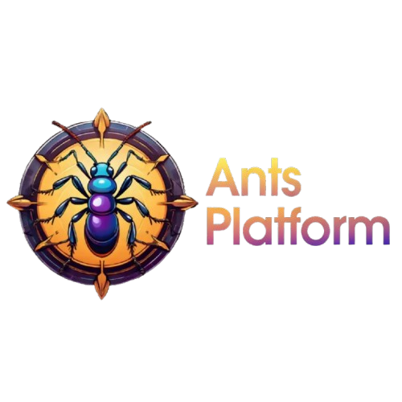

<p align="center">
  
</p>

# Ants Platform JS/TS SDK

[](https://opensource.org/licenses/MIT)
[](https://www.npmjs.com/package/ants-platform)

Modular mono repo for the Ants Platform JS/TS client libraries.

## Packages

| Package                                         | NPM                                                                                                                       | Description                                                    | Environments |
| ----------------------------------------------- | ------------------------------------------------------------------------------------------------------------------------- | -------------------------------------------------------------- | ------------ |
| [@antsplatform/client](./packages/client)       | [](https://www.npmjs.com/package/@antsplatform/client)       | Ants Platform API client for universal JavaScript environments | Universal JS |
| [@antsplatform/tracing](./packages/tracing)     | [](https://www.npmjs.com/package/@antsplatform/tracing)     | Ants Platform instrumentation methods based on OpenTelemetry   | Node.js 20+  |
| [@antsplatform/otel](./packages/otel)           | [](https://www.npmjs.com/package/@antsplatform/otel)           | Ants Platform OpenTelemetry export helpers                     | Node.js 20+  |
| [@antsplatform/openai](./packages/openai)       | [](https://www.npmjs.com/package/@antsplatform/openai)       | Ants Platform integration for OpenAI SDK                       | Universal JS |
| [@antsplatform/langchain](./packages/langchain) | [](https://www.npmjs.com/package/@antsplatform/langchain) | Ants Platform integration for LangChain                        | Universal JS |

## Installation

```bash
npm install antsplatform
# or
yarn add antsplatform
# or
pnpm add antsplatform
```

## Quick Start

```javascript
import { AntsPlatformClient } from "antsplatform";

const client = new AntsPlatformClient({
  publicKey: "your-public-key",
  secretKey: "your-secret-key",
  baseUrl: "https://api.ants-platform.com", // optional
});
```

## Documentation

- [Docs](https://agenticants.ai/docs)

## Development

This is a monorepo managed with pnpm. See [CONTRIBUTING.md](./CONTRIBUTING.md) for detailed development instructions.

Quick start:

```bash
pnpm install    # Install dependencies
pnpm build      # Build all packages
pnpm test       # Run tests
pnpm ci         # Run full CI suite
```

## License

[MIT](LICENSE)
